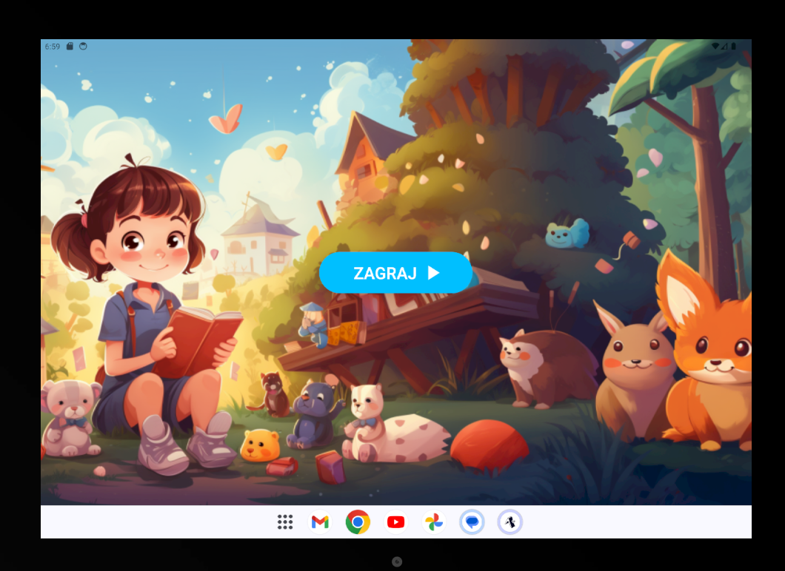
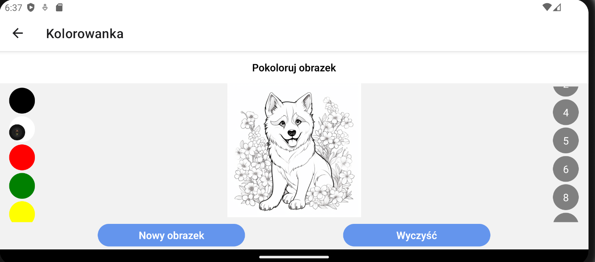
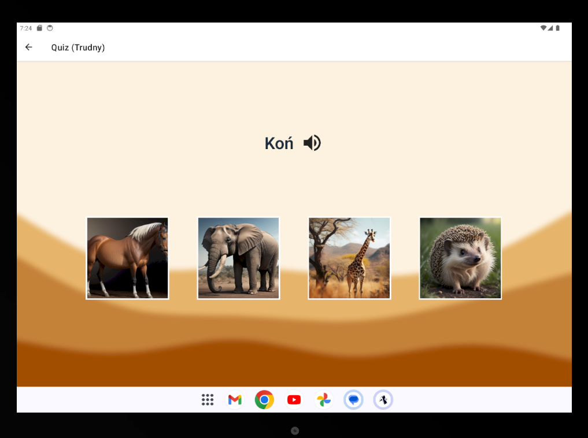
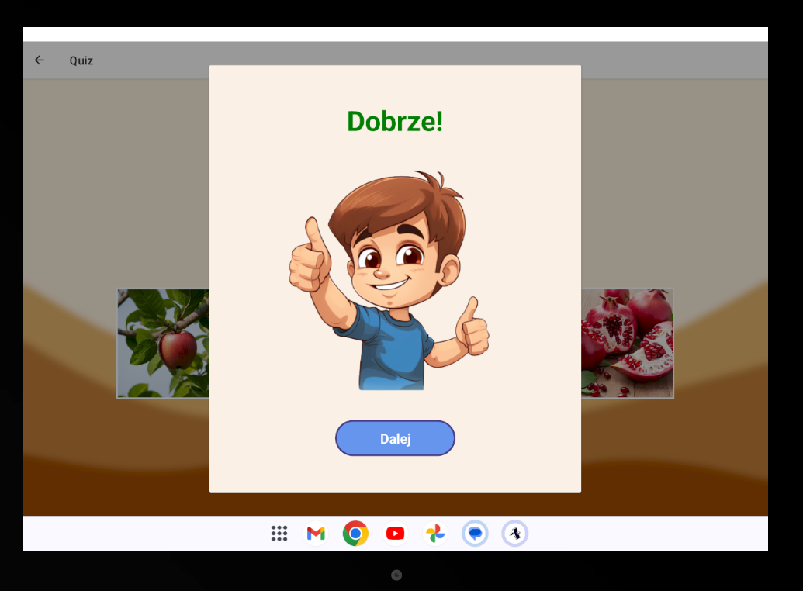
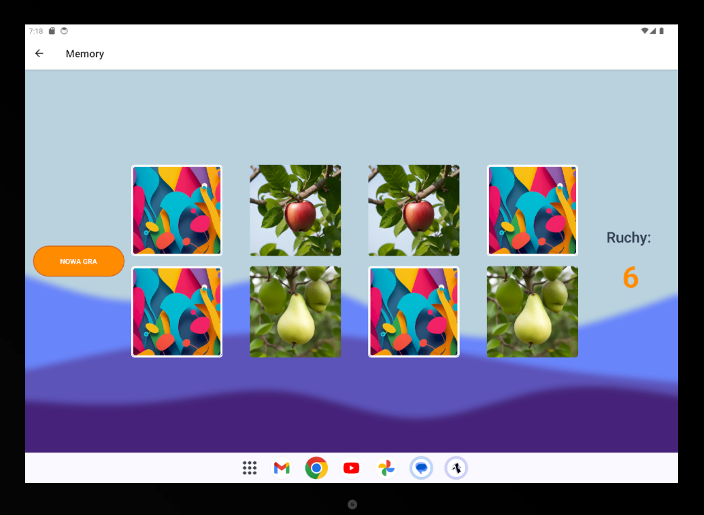

# KidsApp
## O Projekcie
Aplikacja jest rozwiązaniem zadania konkursu Hi-Tech Girls 2023 z dziedziny Software Development – Frontend. Jest ona efektem mojej ciężkiej 3-tygodniowej pracy. Posiada wiele niedoskonałości i rozwiązań, które można przedstawić w lepszy sposób, jednak mimo tego jestem dumna z tego co udało mi się osiągnąć w tak krótkim czasie 😊 Jest to moje pierwsze doświadczenie z react-native i ogólnie projektem na urządzenia przenośne. Uważam, że bez względu na wynik nie jest to stracony czas, a większy krok w mojej karierze. 

**Architektura aplikacji przedstawiona w pliku KidsApp_architektura.png w głównym folderze**

### Cel
Celem aplikacji jest dostarczenie dzieciom narzędzia do nauki liter, słów, oraz mówienia poprzez gry i zabawy. Aplikacja oferuje sekcje nauki słów oraz zestaw gier i zabaw. Każde słowo jest przedstawione za pomocą zdjęcia, wymowy, ciekawostki, a w przypadku zwierząt, także ich odgłosów (obecnie każde zwierzę szczeka 😉). Gry na tę chwilę obejmują "memory", quizy (łatwy, trudniejszy) oraz kolorowanki. Pracowano również nad grą do sortowania owoców i warzyw, ale nie została ukończona w wyznaczonym terminie.

### Cechy Aplikacji
Aplikacja jest obecnie dostępna dla dzieci mówiących po polsku. Zawiera proste dźwięki, duże interaktywne obszary, intuicyjne UI/UX, stonowane kolory oraz realistyczne* zdjęcia, aby dzieci mogły zobaczyć, jak naprawdę wyglądają różne obiekty. Baza danych obejmuje słówka z kategorii pojazdów, owoców, warzyw, zwierząt oraz litery polskiego alfabetu.
(*realistyczne, tzn. wygenerowane przez AI ;P)

## Generowanie Obrazów przez AI
### Miejsce Generowania Obrazów
Wszystkie obrazy były generowane za pomocą sztucznej inteligencji przy użyciu aplikacji Leonardo.ai (wersja darmowa) oraz Midjourney (Subskrypcja Miesięczna - Basic). Każde zdjęcie było generowane indywidualnie, a generowanie pełnych zestawów wiązało się z ryzykiem deformacji i powtarzalności elementów. Jednak to, czego jedno AI nie mogło sobie poradzić z wygenerowaniem, to drugie radziło sobie z tym samym lub podobnym zapytaniem o wiele lepiej, czasem wystarczyły tylko dwa słowa. 

### Przykładowe Zapytania i Słowa Kluczowe

1. **Zwierzęta:**
   - "natural photo"
   - "full posture"
   - "natural environment"
   - "its environment"
   - "simple photo"
   - "side view"
   - "close off"
   - "full body"
   - "distant"

   *Przykłady:*
   - "Full photo of a white duck in its natural environment"
   - "Natural photo of a giraffe in a full posture"
   - "Simple photo of a hedgehog in a natural environment"
   - "Simple photo of a spider in a cobweb"

2. **Pojazdy:**
   - "contemporary"
   - "realistic photo"
   - "city environment"

   *Przykłady:*
   - "Contemporary bike, simple photo"
   - "Contemporary bus, simple photo in a city environment on a sunny day"
   - "Kick scooter, simple photo"

3. **Owoce:**
   - "cut and full"
   - "light background"
   - "white background"
   - "on a plate"

   *Przykłady:*
   - "Photo of garlic and garlic clove on a plate"
   - "Simple photo of chickpea on a light background"
   - "Simple photo of lime on a white background"
   - "Full and cut photo of tomato, lettuce, and avocado on a plate"

4. **Litery:**
   - "writing elementary letter [letter]"
   - "simple illustration cartoon style writing elementary letter [letter]"

   *Przykłady:*
   - "Illustration of a writing elementary letter 'A'"
   - "Simple cartoon-style illustration of writing elementary letter 'B'"

5. **Kolorowanki:**
   - "black and white coloring page cartoon style"
   - "for kids"

   *Przykłady:*
   - "Black and white coloring page for kids: Contemporary police car and a policeman"
   - "Black and white coloring page for kids: Cat laying on a bed"

6. **Inne:**
   - "simple wallpaper"
   - "illustration"
   - "abstraction"
   - "three colors"
   - "light colors"
   - "different colors"
   - "mark question in the middle"

   *Przykłady:*
   - "Simple wallpaper with three light colors"
   - "Illustration cartoon style of a happy child with a trophy on a white background"

### Pomysły na rozwój aplikacji
- Dodanie zewnętrznej bazy danych (np. Firebase).
- Rozszerzenie słownictwa o kolory, cyfry, liczby, przedmioty w różnych obszarach (np. w domu, w szpitalu).
- Dwie wersje przedstawienia elementu: ilustracja i zdjęcie (galeria do przesuwania palcem, więcej zdjęć dla każdego obiektu np. piesków, kotków aby pokazać, że jest wiele ras tych gatunków).
- Więcej interakcji podczas poznawania słówek (animacje, pisanie liter).
- Dodanie nowych gier i zabaw:
    - Puzzle
    - Dopasowywanie słówek
    - Labirynt
    - Szukanie elementów na obrazku (wskazywanie)
    - zabawy muzyczne      
- Wprowadzenie postaci "wirtualnego nauczyciela" wspierającego dziecko.
- Lepsza szata graficzna
- Nauka pisania, pisanie palcem, podążanie ścieżką za jakimś zwierzaczkiem, które idzie drogą w kształcie jakiejś litery
- Kolorowanki w formie wypełniania jakiegoś obszaru danym kolorem (coś w stylu wiaderka w paintcie)
- Zróżnicowane i rozwinięte poziomy gier
- Ścieżka z poziomami gier
- System punktacji gier (1-3 gwiazdki)


## Podsumowanie
Cieszę się, że wzięłam udział w konkursie szczególnie, że była to moja ostatnia okazja na wzięcie w nim udziału.  Mam nadzieję, że moja praca zwróciła Waszą uwagę. Z przyjemnością udzielę dodatkowych informacji podczas rozmowy 😊.

## Instalacja
Jeśli yarn jest zainstalowany, po sklonowaniu repozytorium uruchom następujące komendy:
```
yarn
yarn start
```
do uruchomiania aplikacji na iOS:
```
pod install 
```

## Kilka zrzutów z apki :)






